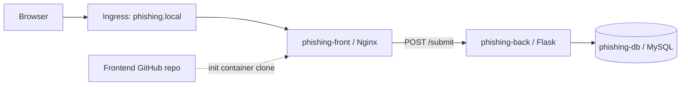

# Kubernetes Phishing App Project
A Kubernetes lab implementation that mimics a phishing workflow — a fake login page, a Flask collector backend, and a persistent MySQL database, all running inside a dedicated namespace.
This repository demonstrates namespace-scoped application deployment using Nginx, Flask, MySQL, node taints/tolerations/affinity, RBAC, NetworkPolicies, Ingress, and cluster resource governance.

> Warning: Educational and authorized lab use only.

---

## Table of Contents
- [Architecture](#architecture)
- [Repository Layout](#repository-layout)
- [Frontend Deployment](#frontend-deployment)
- [Backend Deployment](#backend-deployment)
- [Database StatefulSet](#database-statefulset)
- [Services](#services)
- [Storage and Persistence](#storage-and-persistence)
- [Network Policies](#network-policies)
- [Ingress and External Access](#ingress-and-external-access)
- [RBAC and Project User Setup](#rbac-and-project-user-setup)
- [Resource Governance](#resource-governance)
- [How the App Works](#how-the-app-works)
- [Deployment Instructions](#deployment-instructions)
- [Verification Commands](#verification-commands)
- [Important Notes](#important-notes)

---


## Architecture
High-level flow:


Key characteristics:
- Frontend pulls its HTML at runtime from a GitHub repo via an init container, rather than baking it into the image.
- Both frontend and backend use init containers to wait on their downstream dependency's DNS before starting (frontend waits on backend, backend waits on the database).
- All three tiers are pinned to nodes labeled `project=phishing` via taints/tolerations and node affinity.
- Traffic is locked down by a default-deny `NetworkPolicy`, with explicit allow rules layered on top per tier.

---

## Repository Layout
```
phishing-directory/
  backend/
    app.py            # Flask endpoint: POST /submit, writes to MySQL
    requirements.txt  # Python dependencies
    Dockerfile         # Builds image from python:3.9-alpine
  frontend/
    html/index.html   # Fake login page (Arabic/English)

deployments/   # frontend/backend Deployments, db StatefulSet, Services, mysql-secret
policies/      # deny-all, per-tier NetworkPolicies, ingress
storage/       # backend PV/PVC, db StorageClass
resources/     # hpa, limitrange, resourcequota
crt/           # project-csr, project-role, rolebinding
```

---

## Frontend Deployment
Manifest: `deployments/frontend-deploy.yml`

- Deployed as `phishing-front` in namespace `project`, running **2 replicas**.
- Tolerates `project=phishing:NoSchedule` and requires node label `project=phishing`.
- Init containers:
  - `git-init-container` clones the frontend repo into `/tmp/repo` and copies content to `/html`.
  - `dns-init-container` loops until `phishing-back.default.svc.cluster.local` resolves.
- Main container: `nginx`, serving from `/usr/share/nginx/html`, backed by the `git-shared-volume` (`emptyDir`).

HTML content is intentionally pulled at runtime rather than mounted directly from `phishing-directory/frontend/html/index.html`.

---

## Backend Deployment
Manifest: `deployments/backend-deploy.yml`

- Deployed as `phishing-back` in namespace `project`, running **2 replicas**.
- Same toleration and node affinity as the frontend.
- Init container `dns-init-container` waits for `phishing-db.db-svc.default.svc.cluster.local` to resolve.
- Main container image: `ahmedkhater2611/backend-k8s-project:latest`, listening on port `5000`.
- Mounts `backend-pvc` at `/app/uploads`.

The image is pre-built and pulled from Docker Hub — rebuild and push a new image after any backend code change.

---

## Database StatefulSet
Manifest: `deployments/db-statefulset.yaml`

- Deployed as `phishing-db` (service name `db-svc`) in namespace `project`, **1 replica**.
- Same toleration and node affinity as the other tiers.
- Runs `mysql:8.0` on port `3306`, loading credentials from `mysql-secret` via `envFrom`.
- Volume claim template `mysql-pvc` uses StorageClass `phishing-db-storageclass`, `ReadWriteOnce` access, `200Mi` request, mounted at `/var/lib/mysql`.

---

## Services
- **`phishing-front`** (`deployments/frontend-svc.yml`) — ClusterIP, port `80` → `80`, selects `app: phishing-front`.
- **`phishing-back`** (`deployments/backend-svc.yml`) — ClusterIP, port `5000` → `5000`, selects `app: phishing-back`.
- **`db-svc`** (`deployments/db-headless-svc.yml`) — headless (`clusterIP: None`), port `3306`, selects `app: phishing-db`.

### MySQL Secret
File: `deployments/mysql-secret.yaml`, namespace `project`. Fields: `MYSQL_ROOT_PASSWORD`, `MYSQL_DATABASE`, `MYSQL_USER`, `MYSQL_PASSWORD`,`DB_HOST` `DB_USER`,`DB_PASSWORD`.`DB_NAME` Loaded by the MySQL and Backend pods via `envFrom`

---

## Storage and Persistence
**Backend PV/PVC**
- `storage/backend-pv.yml` — `hostPath` at `/mnt/data/backend-storage`, `1Gi`, `ReadWriteOnce`, reclaim policy `Retain`.
- `storage/backend-pvc.yml` — requests `1Gi`, binds to `backend-pv`, namespace `project`.
- Mounted by the backend deployment at `/app/uploads`.

**Database StorageClass**
- `storage/db-storageclass.yml` — name `phishing-db-storageclass`, provisioner `k8s.io/minikube-hostpath`, reclaim policy `Delete`, volume binding mode `Immediate`.
- Allows the MySQL StatefulSet to dynamically provision its own PVC.

---
 
## Network Policies
- **Deny-all** (`policies/deny-all.yml`)
  - selects all pods, denies all ingress/egress by default.
- **Frontend** (`policies/frontend-policy.yml`)
  - ingress from `ingress-nginx` on port `80`
  - egress to `app: phishing-back` on `5000`
  - egress DNS to `kube-system` on `53/UDP`
- **Backend** (`policies/backend-policy.yml`)
  - ingress from `app: phishing-front` on `5000`
  - ingress from `ingress-nginx` on port `5000`
  - egress to `app: phishing-db` on `3306`
  - egress DNS to `kube-system` on `53/UDP`
- **Database** (`policies/db-policy.yml`)
  - ingress from `app: phishing-back` on `3306` only
- **Frontend GitHub egress** (`policies/allow-github-egress.yml`) — `CiliumNetworkPolicy`
  - selects `app: phishing-front`
  - egress DNS to `kube-dns` in `kube-system` on `53/UDP` and `53/TCP`
  - egress to `github.com` (by FQDN) on `443/TCP` only

This last policy is what lets the frontend's `git-init-container` reach out and clone the repo despite the default-deny policy, without opening broader internet access to the pod. It requires the **Cilium CNI** — plain `NetworkPolicy` can't match egress by FQDN.
 
 
---

## Ingress and External Access
File: `policies/ingress.yml`
- Name `phishing-ingress`, namespace `project`, ingress class `nginx`.
- Host `phishing.local`, path `/` routes to `phishing-front:80`.

Add to `/etc/hosts`:
```text
<MINIKUBE_IP> phishing.local phishing.local
```
Then open:
```text
http://phishing.local
```

---

## RBAC and Project User Setup
- **Role** (`crt/project-role.yaml`) — `project-role` in namespace `project`, grants full CRUD on `services`, `secrets`, `persistentvolumeclaims`, `pods`, `nodes`, `deployments`, `statefulsets`, `ingresses`, `networkpolicies`.
- **RoleBinding** (`crt/rolebinding.yaml`) — binds `project-role` to user `project` in namespace `project`.
- **CSR** (`crt/project-csr.yml`) — name `project-csr`, signer `kubernetes.io/kube-apiserver-client`, `expirationSeconds: 259200`, usage `client auth`.

Not included in the repo — generate after approving the CSR:
- Signed client certificate (`project.crt`)
- Private key (`project.key`)
- kubeconfig entry for the `project` context

---

## Resource Governance
**LimitRange** (`resources/limitrange.yml`)
- Default request: `100m` CPU / `256Mi` memory. Default limit: `500m` CPU / `512Mi` memory.
- Allowed range: `50m`–`2` CPU, `64Mi`–`2Gi` memory.

**ResourceQuota** (`resources/resourcequota.yml`, namespace `project`)
- Pods: `10` · `requests.cpu`: `2` · `requests.memory`: `4Gi` · `limits.cpu`: `4` · `limits.memory`: `8Gi` · `services.nodeports`: `2`

**HorizontalPodAutoscaler** (`resources/hpa.yml`)
- Targets `Deployment/phishing-back`, `2`–`10` replicas, CPU target `60%`.

---

## How the App Works
**Backend** (`phishing-directory/backend/app.py`):
- Accepts `POST /submit`, reading `email` and `password` from form data.
- Connects to MySQL using env vars `DB_HOST`, `DB_USER`, `DB_PASSWORD`, `DB_NAME` (falling back to `mysql-0.mysql-service`, `demo`, `demo`, `phishing_database`).
- Creates the `credentials` table if missing, inserts the submitted record, and returns an Arabic success message.

**Frontend** (`phishing-directory/frontend/html/index.html`):
- Displays an email form, stores the value in a hidden field, then displays a password form.
- Submits both `email` and `password` to `http://phishing.local/submit`.
- Reuses the same container UI across both steps to mimic a real phishing attack flow.

---

## Deployment Instructions
### Build and push the backend image
```bash
cd phishing-directory/backend
docker build -t <dockerhub-user>/backend-k8s-project:latest .
docker push <dockerhub-user>/backend-k8s-project:latest
```

### Apply everything
```bash
kubectl create namespace project

# Set up RBAC and approve the project user's certificate:
kubectl apply -f crt/project-csr.yml
kubectl certificate approve project-csr
kubectl get csr project-csr -o jsonpath='{.status.certificate}' | base64 -d > crt/project.crt
kubectl config set-credentials project --client-key=crt/project.key --client-certificate=crt/project.crt
kubectl config set-context project --cluster=minikube --user=project --namespace=project
kubectl apply -f crt/project-role.yaml
kubectl apply -f crt/rolebinding.yaml

# Provision storage, quotas:
kubectl apply -f storage/db-storageclass.yml
kubectl apply -f storage/backend-pv.yml
kubectl apply -f resources/limitrange.yml
kubectl apply -f resources/resourcequota.yml

# Switch to the project context:
kubectl config use-context project

# Apply secrets and services :
kubectl apply -f deployments/mysql-secret.yaml
kubectl apply -f deployments/db-headless-svc.yml
kubectl apply -f deployments/backend-svc.yml
kubectl apply -f deployments/frontend-svc.yml
kubectl apply -f storage/backend-pvc.yml

# Apply network policies and ingress:
kubectl apply -f policies/deny-all.yml
kubectl apply -f policies/db-policy.yml
kubectl apply -f policies/backend-policy.yml
kubectl apply -f policies/frontend-policy.yml
kubectl apply -f policies/github-svc.yml
kubectl apply -f policies/ingress.yml

# Deploy the workloads:
kubectl apply -f deployments/db-statefulset.yaml
kubectl apply -f deployments/backend-deploy.yml
kubectl apply -f deployments/frontend-deploy.yml
kubectl apply -f resources/hpa.yml
```

### Map the host and open the app
```bash
echo "$(minikube ip) phishing.local" | sudo tee -a /etc/hosts
```
```text
Verify by opening:
http://phishing.local
```

---

## Verification Commands
```bash
# Deployment status
kubectl get all -n project

# Ingress
kubectl describe ingress -n project phishing-ingress

# Services
kubectl get svc -n project

# Logs
kubectl logs -n project deploy/phishing-back
kubectl logs -n project deploy/phishing-front
kubectl logs -n project statefulset/phishing-db

# Stored data
kubectl exec -n project -it $(kubectl get pod -n project -l app=phishing-db -o jsonpath='{.items[0].metadata.name}') \
  -- mysql -u project_user -pproject_password project_db -e "SELECT * FROM credentials;"
```
`Take a Look at the Screenshots folder to see a reference for each output.`


## Important Notes
- The frontend fetches HTML from a GitHub repository via its init container rather than referencing local frontend files directly.
- The backend's in-code environment defaults are aligned with the`DB_*` variables so the `DB_HOST` has to match the name of the headless database service.
- The database StatefulSet uses a dedicated StorageClass and headless service, enabling stable pod naming and persistent data.
- `backend-pvc` is mounted, but the Flask app doesn't currently write to `/app/uploads` — the mount exists primarily to demonstrate PV/PVC usage.